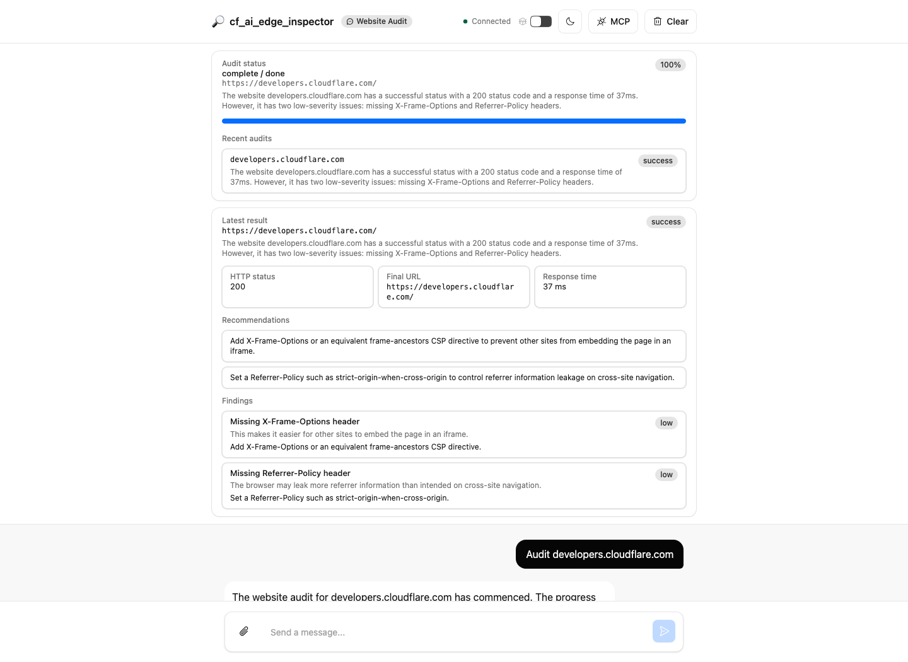
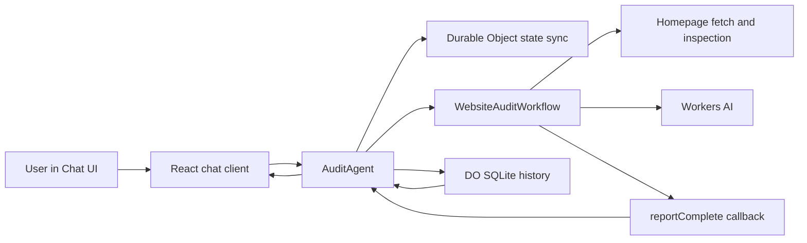

# cf_ai_edge_inspector

[](https://cf-ai-edge-inspector.zheng-jiaju.workers.dev)
[](https://cf-ai-edge-inspector.zheng-jiaju.workers.dev/?room=readme-demo-2)

`cf_ai_edge_inspector` is a Cloudflare-native AI website audit app. A user submits a public URL, the app inspects the homepage response for redirect behavior, HTTPS posture, security headers, cache headers, and basic metadata, then uses `Workers AI` to summarize findings and recommend fixes.

It runs on `Workers`, coordinates audits with `Workflows`, stores progress and history in `Durable Objects`, and supports follow-up questions against saved audit results.

## Project Snapshot

Core capabilities:

| Capability                     | Implementation                                                                                                         |
| ------------------------------ | ---------------------------------------------------------------------------------------------------------------------- |
| `LLM`                          | `Workers AI` with `@cf/meta/llama-3.3-70b-instruct-fp8-fast`                                                           |
| `Workflow / coordination`      | `WebsiteAuditWorkflow` plus `AuditAgent` intent routing and live state sync                                            |
| `User input via chat or voice` | Chat UI over Agent WebSocket transport                                                                                 |
| `Memory or state`              | Durable Object synced state for live progress plus SQLite-backed audit history for saved results and follow-up answers |

Project details:

- Live deployment is available on Cloudflare Workers
- `README.md` includes local run instructions and deployed links
- `PROMPTS.md` records development-time AI prompts

## AI-Assisted Development

AI-assisted coding was used during planning, implementation, and review.

- `Claude Opus 4.6` via Claude Code
- `GPT-5.4` via Codex

Detailed prompt records belong in [PROMPTS.md](./PROMPTS.md).

## End-to-End Flow

1. The user enters a URL such as `Analyze https://example.com`.
2. `AuditAgent` classifies the message as a new audit request and starts `WebsiteAuditWorkflow`.
3. The workflow updates Agent state as it moves through `validating -> fetching -> inspecting -> summarizing -> persisting`.
4. The frontend subscribes to Agent state and renders progress in real time without polling.
5. The workflow builds structured findings, asks `Workers AI` for a short summary and prioritized recommendations, then calls `step.reportComplete(result)`.
6. `AuditAgent.onWorkflowComplete()` persists the final result into SQLite and updates chat-visible history.
7. The user asks follow-up questions such as `What should I fix first?` and the agent answers from the saved audit result.
8. The `Clear` action resets the current session by clearing chat messages, persisted audit history, and synced Agent state.

## Screenshot



Live demo: https://cf-ai-edge-inspector.zheng-jiaju.workers.dev

Shared demo room with a saved audit result:
`https://cf-ai-edge-inspector.zheng-jiaju.workers.dev/?room=readme-demo-2`

## Why Cloudflare

This project keeps the core runtime on Cloudflare:

- `Workers` host the app and deployed link.
- `Agents SDK` provides the stateful chat entry point.
- `Durable Objects` hold sync state and SQLite-backed history.
- `Workflows` run the multi-step audit.
- `Workers AI` generates summaries and follow-up answers.

## Implementation Coverage

| Capability                     | Implementation                                                         | Files                                                                  |
| ------------------------------ | ---------------------------------------------------------------------- | ---------------------------------------------------------------------- |
| `LLM`                          | `Workers AI` with `@cf/meta/llama-3.3-70b-instruct-fp8-fast`           | [src/server.ts](./src/server.ts), [src/workflow.ts](./src/workflow.ts) |
| `Workflow / coordination`      | `WebsiteAuditWorkflow` plus `AuditAgent` intent routing and state sync | [src/workflow.ts](./src/workflow.ts), [src/server.ts](./src/server.ts) |
| `User input via chat or voice` | Chat UI over Agent WebSocket transport                                 | [src/app.tsx](./src/app.tsx)                                           |
| `Memory or state`              | Durable Object synced state plus SQLite-backed audit history           | [src/server.ts](./src/server.ts), [src/types.ts](./src/types.ts)       |

## Architecture



## What It Audits

The audit scope is intentionally narrow and deterministic:

- URL validity and public reachability
- HTTP status and redirect behavior
- HTTPS enforcement
- common security headers
- cache headers
- homepage `title`
- homepage `meta description`

This is not a vulnerability scanner or crawler. It inspects a single public URL and reports edge, delivery, and header posture.

## Core Files

- [src/server.ts](./src/server.ts): `AuditAgent`, chat intent routing, follow-up handling, SQLite history, workflow completion callbacks
- [src/workflow.ts](./src/workflow.ts): multi-step audit workflow, URL normalization, fetch/header inspection, AI summary generation
- [src/types.ts](./src/types.ts): audit result, finding, and synced state types
- [src/app.tsx](./src/app.tsx): chat UI, live progress, latest result, recent history
- [wrangler.jsonc](./wrangler.jsonc): Workers AI, Durable Object, Workflow, and asset bindings
- [scripts/validate-live.mjs](./scripts/validate-live.mjs): deployed end-to-end validation script

## Local Development

Prerequisites:

- Node.js
- npm
- Cloudflare account
- Wrangler authenticated with Cloudflare

Commands:

```bash
npm install
npx wrangler login
npm run types
npm run dev
```

Notes:

- `Workers AI` uses a remote binding, so local development requires `wrangler login`.
- If `wrangler.jsonc` changes, rerun `npm run types`.

## Deploy

```bash
npm run deploy
```

This deploys the Worker, static assets, Durable Object binding, Workflow binding, and Workers AI binding.

## Example Prompts

- `Analyze https://example.com`
- `Audit developers.cloudflare.com`
- `What should I fix first?`
- `Show me the latest audit result`
- `Compare with my previous scan`
- `Clear the current session`
- Open a fixed room with `?room=<name>` to revisit the same persisted session

## Validation

Static checks:

```bash
npm run check
```

Live end-to-end validation against the deployed Worker:

```bash
npm run check:live
npm run check:live -- http://github.com
npm run check:live -- http://
```

Validated flows:

- `https://example.com`: partial result, progress sync, findings, persistence, follow-up
- `http://github.com`: redirect path, persistence, follow-up
- `http://`: `invalid_url` path, persistence, follow-up
- `Clear`: chat transcript, audit history, and synced Agent state reset to empty

## Known Limitations

- The audit only checks the homepage response. No recursive crawl, screenshotting, browser rendering, or vulnerability scanning.
- Fetches use a fixed timeout and may classify origin blocking or rate limiting as a valid finding.
- One `Workers AI` model currently handles both summary generation and follow-up answers.
- The UI still contains some starter-era panels that are not essential to the core audit workflow.
- `Clear` is intentionally disabled while an audit is running, because clearing mid-workflow would create inconsistent state once the workflow completes.
